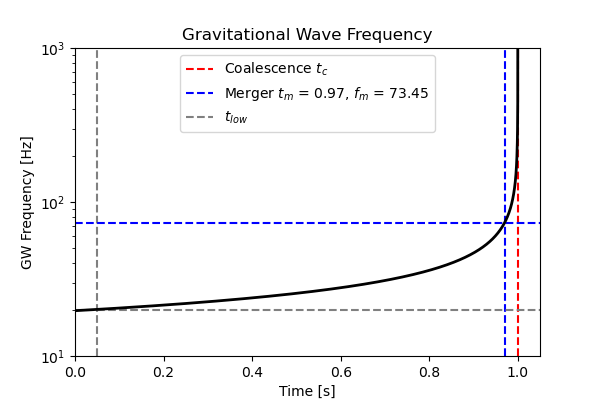

2---
title: Introduction to Gravitational Waves
author:
  - name: Binh Nguyen
    affiliations: Universite Paris Saclay
    email: yenbinhpy308@gmail.com
date: 2026-02-17
---

# Introduction

The merger of a binary system (e.g. two black holes) generates gravitational waves. A typical amplitude from detected signals is divided into three main phases, as shown in {numref}`fig-gw-amp`. This course will focus primarily on the first *inspiral* phase, where the two black holes are still well separated.

```{figure} ../images/astrocosmo/bh_merging.png
---
width: 70%
align: center
name: fig-gw-amp
---
A typical gravitational-wave signal produced by a pair of coalescing black holes. The inspiral phase can be described by post-Newtonian series expansion, while the late part of the ringdown phase can be described using linear perturbation theory (blue parts of the signal). The merger and early ringdown, however, exhibit nonlinear spacetime dynamics (orange part of the signal).
```

> How does one extract the properties of the binary black holes (e.g. the masses of the two BHs, their distance from us, etc.) from the data?

```{figure} ../images/astrocosmo/gw-first-detection.png
---
width: 70%
align: center
name: fig-gw-detection
---
LIGO measurement of gravitational waves at the Livingston (right) and Hanford (left) detectors, compared with theoretical predicted values.
```

To study the *inspiral phase*, we can use perturbation theory:

$$
g_{\mu \nu} = \bar{g}_{\mu \nu} + h_{\mu \nu}, \qquad \text{where} \quad |h_{\mu \nu}| \ll 1,
$$

where $\bar{g}_{\mu \nu}$ can be the Minkowski or FLRW metric, depending on whether we are studying binary systems on astrophysical or cosmological scales.

## Gravitational waves in cosmology

Gravitational waves play an increasingly important role in cosmology, with two main applications:

- **$H_0$ measurement**: by observing individual sources (e.g. binary black holes) on cosmological scales, we can independently measure the Hubble constant.
- **Stochastic Gravitational Wave Background (SGWB)**: analogous to the CMB for photons, this background carries information about the early universe. At high redshifts ($z \gg 5$), there are two main components:
    1. **Astrophysical components**: individual signals from many unresolved sources superpose to form a background.
    2. **Cosmological/primordial components**: originating from primordial sources in the early universe (e.g. inflation, phase transitions, cosmic strings).

```{important}
Due to the **weakness of gravitational interactions**, gravitons **decouple from the primordial plasma** from **$t_{\rm pl}$ onwards** — much earlier than photons (**$z \lesssim 1100$**).

Therefore, the **SGWB contains information about the primordial universe**, potentially revealing **physics at inaccessible energy scales**.
```

```{hint} Strong evidence for SGWB
:class: dropdown

In Summer 2023, pulsar timing array collaborations announced strong evidence for a stochastic gravitational wave background.

- Observation time: $T \sim 1$ yr
- Characteristic frequency: $f_{\mathrm{GW}} \sim 10^{-9}$ Hz
- Corresponding wavelength: $\lambda_{\mathrm{GW}} \sim \dfrac{c}{f_{\mathrm{GW}}} = \dfrac{3 \times 10^8 \,\mathrm{m/s}}{10^{-9}\,\mathrm{Hz}} \approx 10 \,\mathrm{pc}$

This opens a new window to test Grand Unified Theories (GUTs) and early universe physics.
```

# Order of magnitude estimates for black hole ringdown

During the ringdown phase, a perturbed black hole oscillates at characteristic complex frequencies (quasinormal modes):

$$
\omega = \omega_R + i \omega_I.
$$

- **Oscillation frequency**: for the fundamental mode ($l = 2, n = 0$):
  $$
  f = \frac{\omega_R}{2\pi} = \frac{c^3}{G_N M} \frac{1}{3\pi\sqrt{3}} \approx 12 \,\mathrm{kHz} \left( \frac{M_\odot}{M} \right).
  $$
  More generally, $f \propto 1/M$.

- **Decay time scale**: 
  $$
  \tau \sim \frac{1}{\omega_I} = 3\sqrt{3} \left( \frac{G_N M}{c^3} \right) \frac{1}{n + \frac{1}{2}},
  $$
  where $n$ is the overtone number. For the fundamental mode, $\tau \approx 0.55 \, \mathrm{ms} \, (M/M_\odot)$.


A summary of the key gravitational-wave observables for different detectors:

| Detector                   | $f_{\rm GW}$ (typical)      | $\tau$ (ringdown decay time) | Typical $M$                   |
| -------------------------- | --------------------------- | ---------------------------- | ----------------------------- |
| LVK (LIGO/Virgo/KAGRA)     | $\sim 10$–$10^3$ Hz         | $\sim 10^{-3}$–$10^{-2}$ s   | $\sim 10$–$100 M_\odot$       |
| LISA                       | $\sim 10^{-4}$–$10^{-1}$ Hz | $\sim 10^3$–$10^4$ s         | $\sim 10^6$–$10^9 M_\odot$    |
| PTA (Pulsar Timing Arrays) | $\sim 10^{-9}$–$10^{-7}$ Hz | $\sim 10^7$–$10^9$ s         | $\sim 10^9$–$10^{10} M_\odot$ |

:::{hint} First detection of a black hole ringdown
:class: dropdown

- By LVK (from GW150914) 
- Provided the first direct observation of the quasinormal modes predicted by general relativity. 
- Measuring the amplitudes and frequencies of these modes opens the possibility to test the Hawking area theorem: that the total horizon area after merger $A$ should satisfy $A \ge A_1 + A_2$. 
- While current LVK data are consistent with this bound, higher signal-to-noise detections of multiple ringdown modes in the future could provide a quantitative test of this fundamental prediction.
:::

---

## Detector types

### Laser interferometers

* **LVK** (LIGO, Virgo, KAGRA) and **LISA** are interferometers based on Michelson–Morley experiments.
* The basic principle: measure tiny changes in arm length $\delta L$ caused by passing gravitational waves (GW).

$$
ds^2 = g_{\mu \nu} dx^\mu dx^\nu
$$

* **LVK network**: 2 detectors in the USA (LIGO Hanford & Livingston), 1 in Pisa (Virgo), 1 in Japan (KAGRA).
* Fixed on Earth → limited angular resolution; **multiple detectors needed** to triangulate the sky position:

$$
\frac{\delta L}{L} \sim h \sim 10^{-21}
$$

* If $L_0 \sim 1, \rm km = 10^3, m$, then $\delta L \sim 10^{-18}, m$ (smaller than a proton!)
* **LISA**: $L_0 \sim 10^6, \rm km$, space-based for low-frequency GW detection.

### Pulsar Timing Arrays (PTA)

* Use extremely regular pulsar signals ($\Delta t \sim \rm ms$).
* Monitor **many pulsars over years** ($T \sim$ decades) $\to$ sensitive to **very low-frequency GWs**, $f \sim 10^{-9} - 10^{-7}, \rm Hz$.
* Statistics from an ensemble of pulsars allow detection of stochastic GW background.

---

## Inspiral phase of a binary system

* Valid when two objects are **far apart**. Linear perturbation theory applies:

$$
g_{\mu \nu} = \bar g_{\mu \nu} + h_{\mu \nu},
\quad
\bar g_{\mu \nu} =
\begin{cases}
\eta_{\mu \nu}, & \text{if source not cosmological} \\
\text{FLRW metric}, & \text{if cosmological scales}
\end{cases}
$$

* **Features of the inspiral**:

$$
f_{\rm GW}(t) = \frac{1}{\pi} \left( \frac{G \mathcal{M}}{c^3} \right)^{5/8} \left( \frac{5}{256 \tau} \right)^{3/8},
\quad
\mathcal{M} = \frac{(m_1 m_2)^{3/5}}{(m_1 + m_2)^{1/5}}, \quad \tau = t_c - t
$$



* **Time to merge** (assuming $f_m \gg f_{\rm low}$):

$$
T \sim 10^{-3} f_{\rm low}^{-8/3} \left( \frac{c^3}{G \mathcal{M}} \right)^{5/3}
$$

* **Amplitude and distance**:

$$
h \sim \frac{4}{d} \left( \frac{G \mathcal{M}}{c^3} \right)^{5/3} (\pi f_{\rm GW})^{2/3}
$$

  Maximum GW amplitude occurs at $t_m$ where $f_{\rm GW} = f_m$.


---

## Typical GW properties for different binaries

| Source type                      | Binary NS          | Stellar-mass BH   | Supermassive BH   |
| -------------------------------- | ------------------ | ----------------- | ----------------- |
| Mass $m_1$                       | $1.4 \,M_\odot$      | $30\,M_\odot$      | $10^6 \,M_\odot$    |
| Mass $m_2$                       | $1.4 \,M_\odot$      | $30\,M_\odot$      | $10^6 \,M_\odot$    |
| $f_{\rm merge}$                  | $\sim 1.5 \,\rm kHz$ | $\sim 200 \,\rm Hz$ | $\sim 0.1 \,\rm Hz$ |
| $f_{\rm low}$                    | $10,\rm Hz$        | $20,\rm Hz$       | $10^{-4}\,\rm Hz$  |
| Time to merger $T$               | $\sim 4\,\rm min$   | $\sim 0.2\,\rm s$  | $\sim$ years      |
| Typical distance $d$             | $40\,\rm Mpc$       | $400\,\rm Mpc$     | Gpc               |
| Amplitude at merge $h_{\rm max}$ | $\sim 10^{-21}$    | $\sim 10^{-21}$   | $\sim 10^{-16}$   |
| Typical strain radius $r$        | $10$–$100\,\rm km$  | $100\,\rm km$      | AU–pc scale       |

